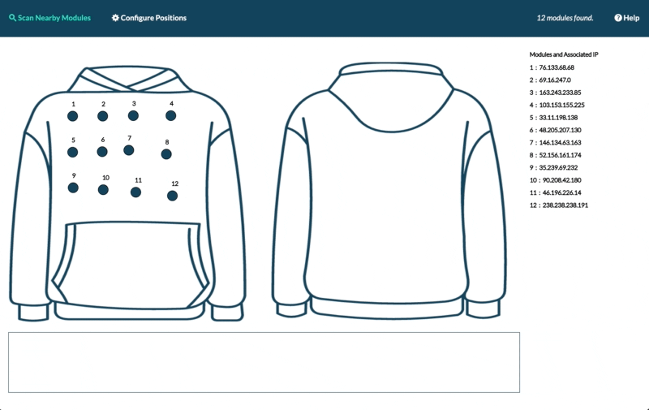

# Haptic-Jacket-API-Python
 Python API for Haptic Jacket Controller Application

 Download this repository on computer to use.

 Refer to the User Guide on [Gitbook](https://pi31415.gitbook.io/haptic-jacket/) for information.

 ## To Do

- Scan the IPs into the dictionary, it's more convenient. Keys as strings
- Read from the text file/ or scan from network.
- Instead of activate, put control motor function which allows different parameters
- separate for GUI
- Value in dictionary should be the IP number
- Allow hard code the message
- Have low level control
- Build a very simple demo application
- for single, multiple or moving
- as comprehensive and control as possible
- Put on one stable environment
- George will also have feedback
